# Cucumber Template

Exercise template for exercises 1 and 2 on, the Software Testing Quality Assurance 2025 course.
This readme contains technical instructions for configuring IntelliJ Idea

NOTE : we strongly recommend IntelliJ Idea, and have provided a walktrough on configuring Idea. 

 Disclaimer 

 If you are adamant on using another editor, support will be limited if any in the context of the course. 

For technical questions you can contact otkang@utu.fi

### Dependencies 
gherkin    
cucumber-java

## Cloning the repo

 Click here to open 

If Idea defaulted to opening latest opened project, in that case you can simply :

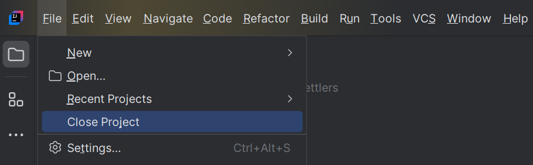

This is what you should be greeted with, the welcome screen. To clone the repo, you can click here:

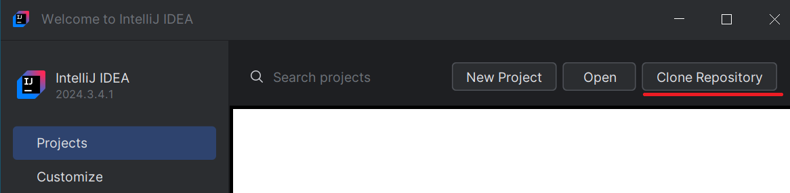

After that, you can paste the repository link in here, and choose your desired installation directory. Make sure you don't have dangling # on the end of the link.
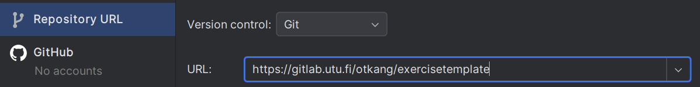

## Installing plugins

 Click here to open 

For exercise 2, two plugins are needed, please install them right away.

Easiest way to install plugins is through the settings.

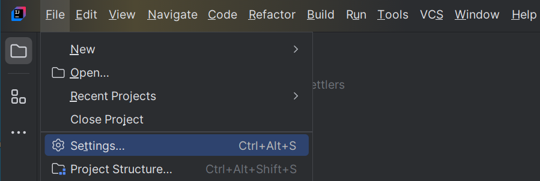

Then, install Gherkin. From settings, click plugins. You can search from the bar marked by red. Press apply.

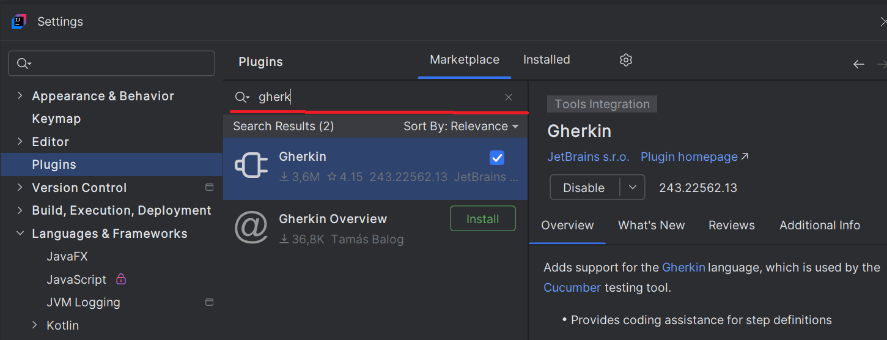

Last Cucumber for Java. Press apply, then OK. This will port the plugins to your project.

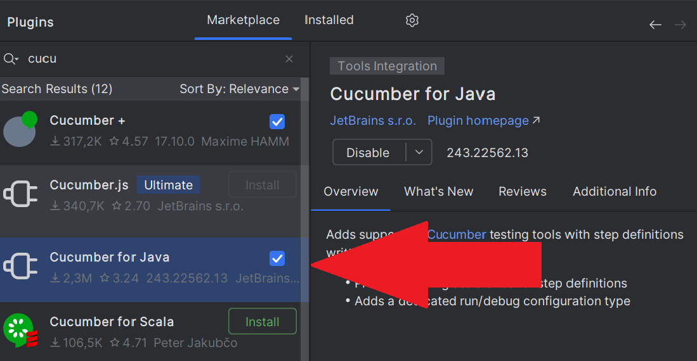

# Exercise 1 technical instructions

 Click here to open instructions 

Because we are using the same exercise template for both week 1 and week 2, we will utilize test configurations on week 1. Test configuration is an editor tool for choosing which tests to run which is perfect for us on week 1.

First click on the down arrow left to the big shiny green button.
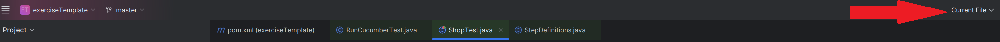

Then, click on edit configurations to add a new test configuration.
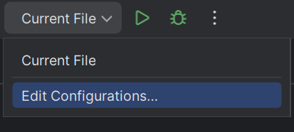

Next, simply choose add new from the left panel, simply press add new and dropdown menu will appear where Junit needs to be picked

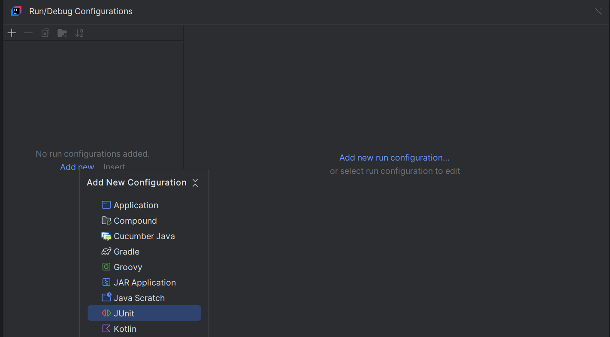

You should see something like this. Make sure to add the exerciseTemplate.shopTest into the box marked in red. The editor will offer autofill so you can click the class.
The name of your configuration is not critical.

However, what is critical is choosing the corresponding *coverage* of your configuration. For exercise 1, you can simply use the **Class** since we are writing only a handful of unit tests. 

As you can see, there is a blank test for you to test your test configuration (pun intended).
To run your all-inclusive test battalion, simply press the shiny green button or choose it from the dropdown menu:

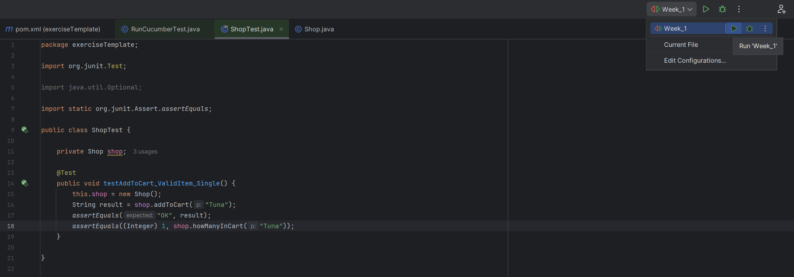

Now, you are ready to proceed with the handout and write your own unit tests. 

## Final note

Click to learn more 

In a real world application, all kinds of testing configurations can be made based on the scope, as well as the stage of development. 

Theory and concepts you will learn in this course usually are usually very tightly connected to practical development work, and part of learning to work with a framework (such as JUnit) is learning what kind of vocabulary is used to describe the concepts.

For JUnit, you can find the documentation on https://junit.org/junit5/docs/current/user-guide/

# Exercise 2 technical instructions

 Reverting to default test configuration 

Now, because the exercise template was created using the cucumber archetype, there cucumber test scenario is still the default test run configuration in the project. We simply need to delete our week_1 test scenario.

Open again open the drop down menu to the left of the big shiny green button.

Now, we can remove the dummy unit test configuration by pressing the minus button. 

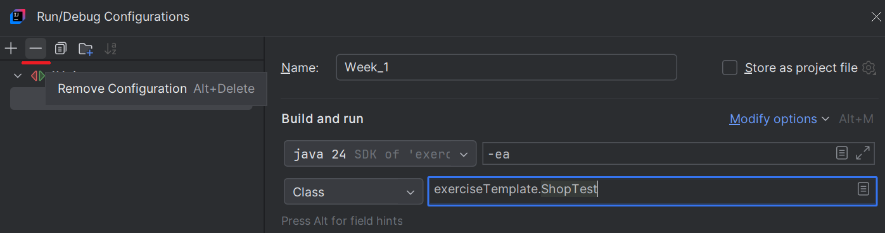

The editor will revert back to the default run configuration which is the RunCucumbertests.java

 Running the default cucumber test 

For exercise 2, please make sure the gherkin and cucumber-java plugins are installed.

Navigate to file RunCucumberTest.java. Press the big shiny green button. In the console, you should see some word vomit complaining about the lack of features.

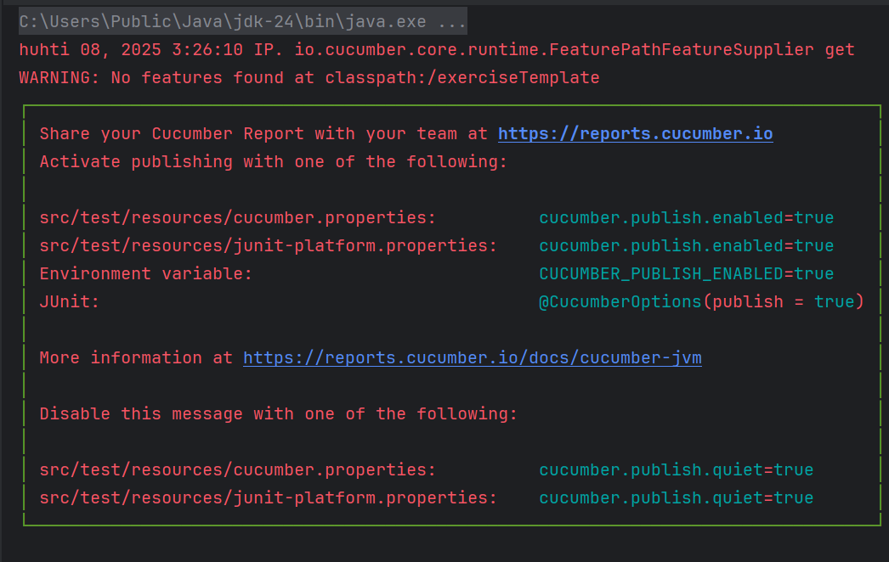

This means the cucumber plugin is able map your gherkin syntax into actionable java code and execute it.

## Running cucumber tests in Idea

 Click here for instructions 

Lets walk through the Is-it-Friday, Justin Case.
https://cucumber.io/docs/guides/10-minute-tutorial/

First, you need a feature file. Right click on the src/test/resources, choose new File.

Write your feature name on the prompt, make sure you name it IsItFridayYet.feature or something breezy. If you see a sort of sliced open cucumber icon for the file on the file toolbar on Idea, it is a great sign.
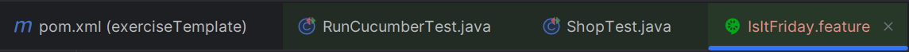

Paste the test environment test from the tutorial. You should be able to see small double arrows to the left of your code. This means that the plugin is recognizing the features and scenarios. If that is the case, you can simply press the big shiny green button to run your tests in Idea.
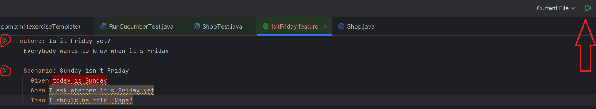

Lastly, make sure that in your console, you can see something like this : 

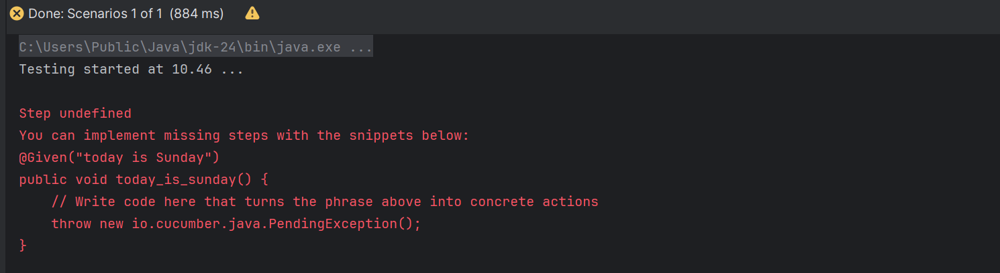

If you scroll more from the console, you should see that the console prompts you to do the same things as in the 10 minute tutorial.
That means you are ready to continue with the 10 minute tutorial from the heading "See scenario reported as undefined".

